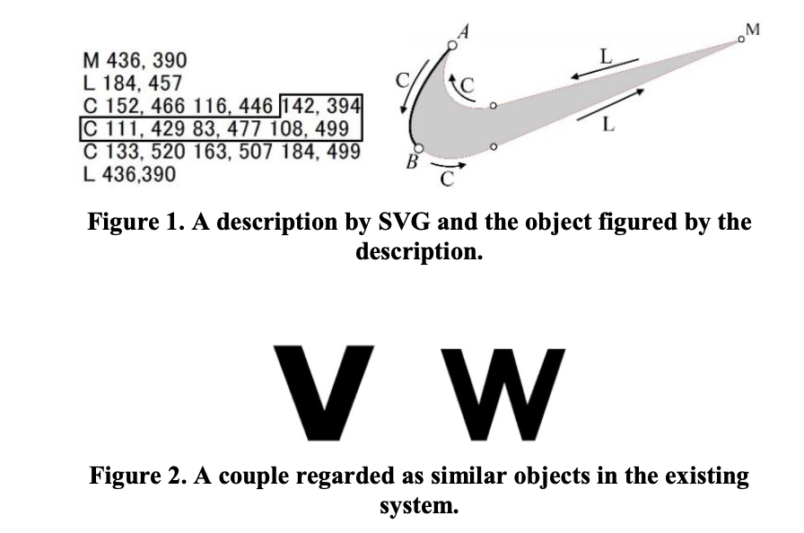
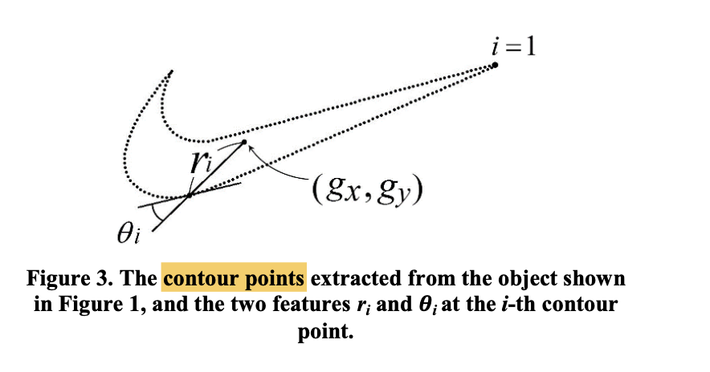

# Similarity Retrieval of Trademark Images by Vector Graphics Based on Shape Characteristics of Components

2018, ICCAE 2018: Proceedings of the 2018 10th International Conference on Computer and Automation Engineering

Koji Abe, Hiroyuki Morita, Takahiro Hayashi

# 1. Problem: 
similarity retrieval of trademark images represented by vector graphics.

# 2. Solution:
the extraction of feature vectors for an object’s contour shape, and the method of centroid distance is introduced into the feature extraction.

# 3. Method:

Calculations of similarity are measured by Euclidean distance with the vector r and cosine similarity with the vector 𝜽.

