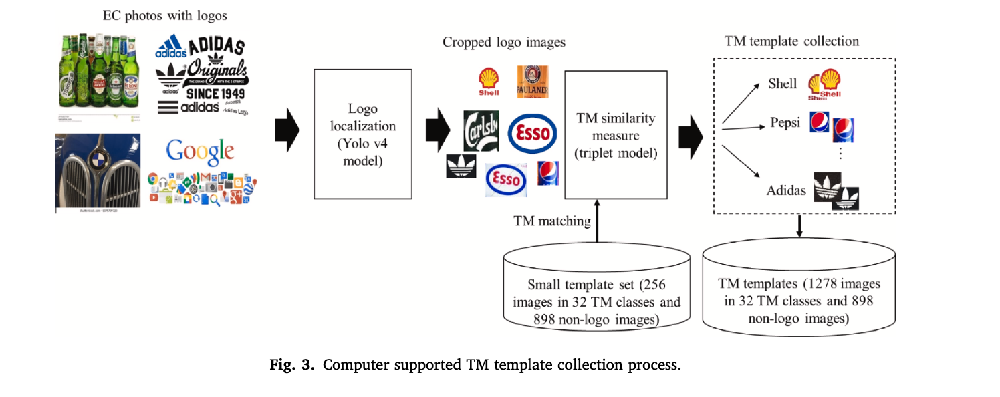

# Intelligent Trademark Recognition and Similarity Analysis Using a Two-Stage Transfer Learning Approach
February 28, 2022, Advanced Engineering Informatics (Elsevier)

Authors: Amy J.C. Trappey, Charles V. Trappey, Eason Lin

DOI: 10.1016/j.aei.2022.101567

## 1. Problem:

- Increasing Trademark Infringement -> Manual Detection is Inefficient

## 2. Proposed Solution:

A two-stage deep learning system for automated trademark detection and similarity analysis, using:

- YOLO v4 for detecting and cropping logos in product images.
- Triplet CNN to compare logos with a registered trademark database.
- The difference for triplet model training is that the triplet pairs (a, p, n), are applied for training where “a” is the anchor, “p” is the similar image, and “n” is dissimilar image. The triplet loss will induce similar image pairs closer and dissimilar image pairs further away from each other during the training.
- 

## 3. Results:

- Dataset: **FlickrLogos-32** (Benchmark Dataset):
  - 3,960 images
  - 32 logo classes
  - Used to test the logo detection and localization (YOLO v4 model)
  - Metrics: Average Precision (AP), Recall
  - Results:
  - YOLO v4 AP = 0.454
  - YOLO v4 Recall = 0.815
  - Trademark Similarity Matching (Triplet CNN):
    - Precision: 0.91
    - Recall: 0.46
    - mAP: 48.6 (compared to previous work’s 52.7)
    - The two-stage system successfully identified potential trademark infringements with high accuracy.

- Dataset 2: E-commerce Product Images (Real-World Testing)
  - 1,114 images collected from Amazon and other e-commerce sites
  - 651 images contained target trademarks
  - Used to test the full system (YOLO v4 for detection + Triplet CNN for trademark similarity analysis)
  - Metrics: Precision, Recall, F1-score
  - Results:
    - Precision = 0.91 (at top-10 TM matching)
    - Recall = 0.46
    - Mean Average Precision (mAP) = 48.6

## 4. Proposed Method:

1. Preprocessing:
- Dataset includes images from LogoDet-3k and real-world web images.
- Images are resized and labeled with bounding boxes.

2. Model Training:
- YOLO v4 is pretrained on MS COCO and fine-tuned for logo detection.
- Triplet CNN (based on ResNet-50) is trained using similarity-based loss functions.

3. Evaluation Metrics:
- Precision, Recall, F1-score
Mean Average Precision (mAP)

