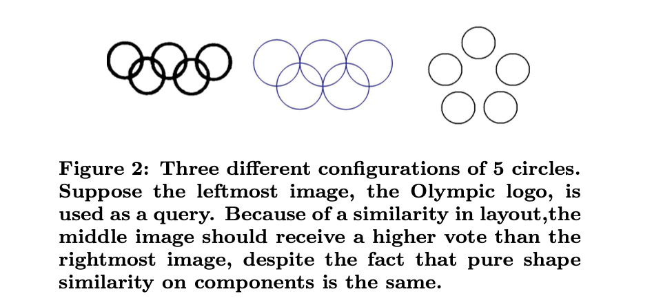
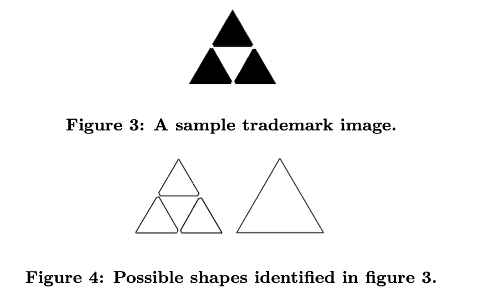

# Layout Indexing of Trademark Images
July 2007, CIVR ’07 (ACM International Conference on Image and Video Retrieval)

Authors: Reinier H. van Leuken, M. Fatih Demirci, Victoria J. Hodge, Jim Austin, Remco C. Veltkamp 

# 1. Problem: 
Current retrieval methods mostly focus on shape similarity, neglecting spatial layout.

Or the challenge of trademark image segmentation and shape identification

# 2. Proposed Solution:
- A graph-based indexing framework to retrieve trademarks based on layout similarity.
- Uses spatial relationships rather than just individual shape features.
- Indexing is achieved via Laplacian eigenvalues, making retrieval more efficient.

# 3. Datasets:
- 450 trademark images from the UK PTO dataset (used in the ARTISAN project).
- Two versions of graphs were created:
  - Manually labeled graphs
  - Automatically generated graphs

# 4. Evaluation:
- Leave-one-out cross-validation for retrieval testing.
- Precision & Recall metrics were used.
- Key Findings:
  - 98.4% (manual graphs) & 89.1% (automatic graphs) correct nearest-neighbor classification.
  - The system pruned 82-84% of the dataset while maintaining high recall.
  - 91.2% first-tier accuracy (correct matches in top K results).
  - 98.1% second-tier accuracy.
Results:
- The framework outperformed traditional shape-based methods in retrieval efficiency.
- Demonstrated strong robustness against occlusion and noise.
- Further improvements suggested in segmentation and topological feature integration.

# 5. Methodology:
Step 1: Image Segmentation
- Trademarks are segmented into distinct shapes using a closed shape identification algorithm.

Step 2: Graph Representation
- Shapes are converted into a graph representation where:
  - Nodes = individual shapes
  - Edges = spatial relations (directional/topological)

Step 3: Graph-Based Indexing
- Computes Laplacian eigenvalues as graph signatures.
- Converts graph matching into a nearest-neighbor search in a vector space.

Step 4: Efficient Search
- Stores subgraph signatures to allow partial matching for robustness against occlusions.

# 6. Limitations: 
Dependent on segmentation accuracy, requires further validation with larger datasets.
