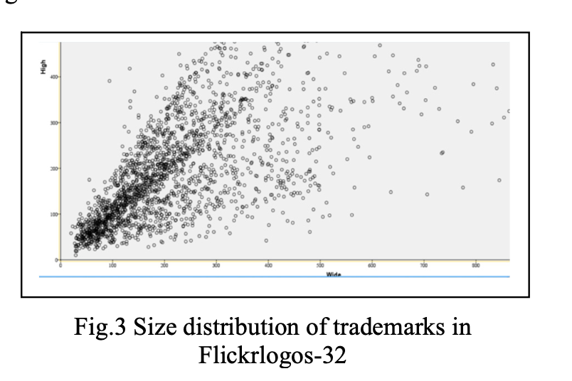
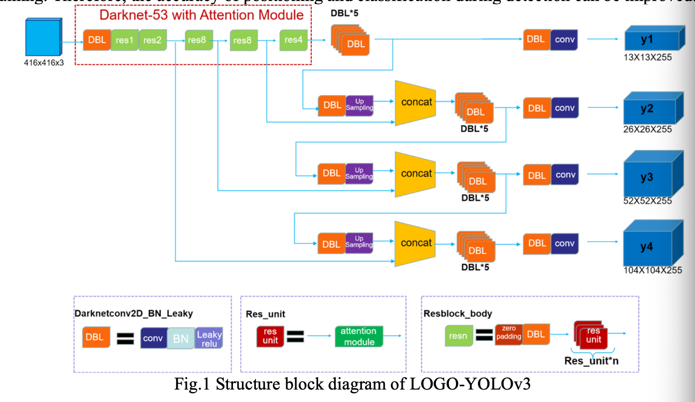

# A Real-time Trademark Detection Method
2020, Journal of Physics: Conference Series (JPCS)

DOI: 10.1088/1742-6596/1693/1/012106

Authors: Yang Leng, Qixiong Fan

## 1. Problem: 
*Real-time* capability of trademark detection suffers from *false detections* in complex backgrounds and *difficulty handling size variations* in different trademarks.

Limitations of existing methods: 
- Traditional feature-based detection is *time-consuming, lacks generalization, and has low accuracy*.
- Region-based CNNs (Faster R-CNN) improve accuracy but cannot perform *real-time detection* due to computational complexity.
- Regression-based methods (YOLO) enable real-time detection but struggle with *small object detection* and complex backgrounds.

## 2. Proposed solution: 
LOGO-YOLOv3, an enhanced version of YOLOv3 with:
- Channel and Spatial Attention Mechanisms to reduce background interference.
- Additional detection layer in Feature Pyramid Networks (FPNs) to better handle trademark size variations.
- Second-order residual connections to reduce feature loss and accelerate convergence.
- Maintains real-time capability while improving accuracy.

## 3. Dataset: 
Flickrlogos-32
- Contains 32 trademark classes with 2,240 images.
- Split: 2016 images for training, 224 for testing.
- Trademark sizes vary, making it a good benchmark for real-world applications.

## 4. Evaluation Metrics:
- Mean Average Precision (mAP): Higher indicates better detection performance.
- Frames Per Second (FPS): Measures real-time performance (higher is better).

## 5. Results: 
| Model | mAP (%) | FPS |
|-------|---------|-----|
| YOLOv3 | 47.91 | 36.1 |
| YOLOv3-y4 (extra detection layer) | 51.34 | 34.4 |
| LOGO-YOLOv3 (full model) | 51.86 | 33.9 |

- LOGO-YOLOv3 improves mAP by 3.95% over standard YOLOv3.
- LOGO-YOLOv3 is slightly slower than YOLOv3 (2.2 FPS lower) but still fast enough for real-time detection.

## 6. Methodology:

1. Feature Extraction Enhancement

- Uses Darknet53 as the base network.
- Adds channel attention to emphasize important features.
- Adds spatial attention to focus on important areas within an image.

2. Multi-scale Prediction Network

- Standard YOLOv3 uses three detection layers (13×13, 26×26, 52×52).
- LOGO-YOLOv3 adds a fourth detection layer (104×104) to handle smaller trademarks.
- Uses Feature Pyramid Networks (FPNs) to enhance robustness against different sizes.

3. Loss Function

- Retains YOLOv3's loss function (combining classification, confidence, and localization losses).
- Optimized using Adam optimizer.

## 6. Conclusion:
- LOGO-YOLOv3 improves accuracy while keeping detection real-time.
- The extra detection layer enhances small-object detection.