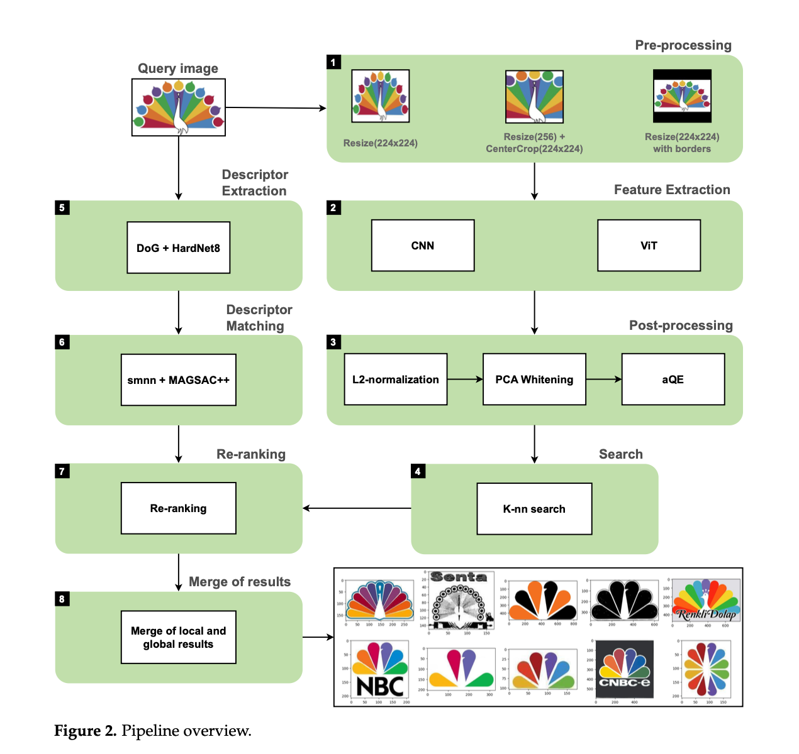
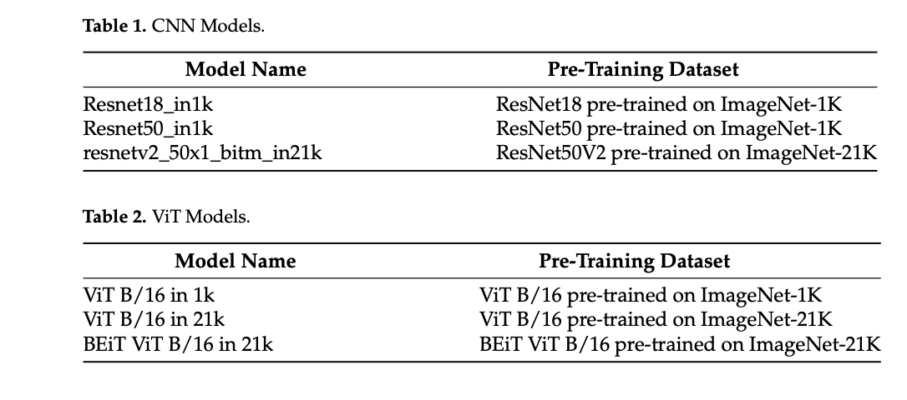
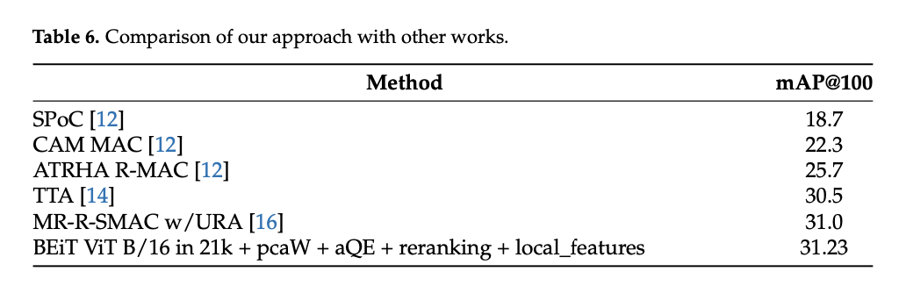

Trademark Similarity Evaluation Using a Combination of ViT and Local Features

2023, Information (MDPI), Q3

Authors: Dmitry Vesnin, Dmitry Levshun, Andrey Chechulin

# 1. Problem statement:
- addresses trademark similarity analysis
- Existing methods rely on CNN-based features but have limitations in handling *heavily stylized trademarks.*
- Objective: Improve accuracy by using Vision Transformer (ViT) features and local feature extraction.

# 2. Proposed solution:
- Hybrid Approach: Combines ViT-based global features and local features.
- Key Contributions:
  - Comparison of CNN vs. ViT for trademark retrieval.
  - Pre- and post-processing optimizations (scaling, normalization, query expansion).
  - Use of local descriptors (DoG + HardNet8) for re-ranking search results.
  - Fusion of local and global features to enhance retrieval precision.

# 3. Dataset:
METU Trademark Dataset

# 4. Methodology:

# 5. Experiment and Results:
Dataset: METU Trademark Dataset

