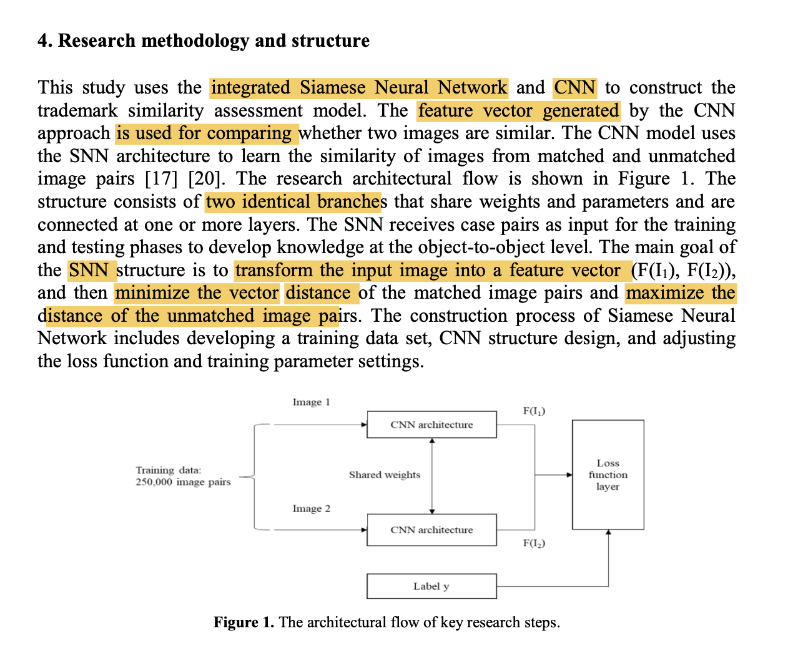

# Detecting Trademark Image Infringement Using Convolutional Neural Networks

2022, Applications of Deep Learning and Artificial Intelligence Methods

Author: Amy J.C. TRAPPEYa,1, Charles V. TRAPPEYb and Sam C.-C. LINa

# 1. Problem: 
Trademark Image Infringement
# 2. Solution: 
The convolutional neural network (CNN) and Siamese neural network (SNN) algorithms are modeled and trained using Cifar-10 and TopLogo-10 corpuses.
# 3. Method:
