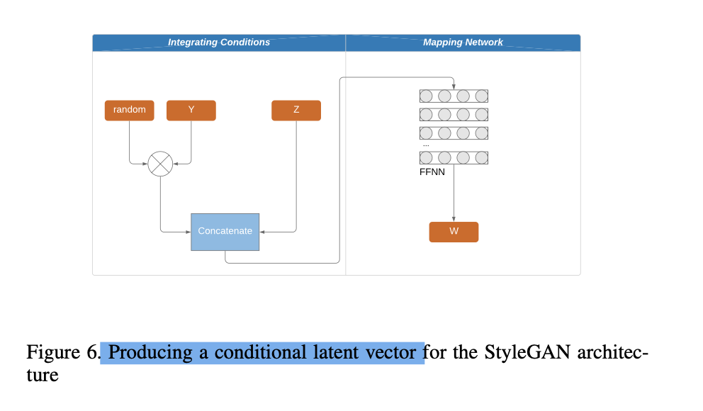
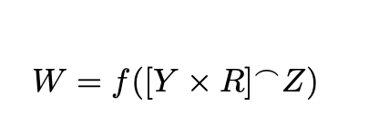

# LoGANv2: Conditional Style-Based Logo Generation with Generative Adversarial Networks

2019, International Conference On Machine Learning And Applications (ICMLA), rank C

Authors: Cedric Oeldorf, Gerasimos Spanakis

## 1. Problem:
Problem in logo synthesis: 
- Limited control over shaping the output of the network
- Low resolution results

## 2. Solution:
- Propose LoGANv2 explores a **conditional extension** to the StyleGAN architecture

## 3. Dataset: 
- LLD-logo (large logo dataset) consists of 122,920 logos.

## 4. Methodology:
### 4.1 Label Extraction:
Step 1: Using the Google Vision API, each logo is given 4 to 8 word labels .

Step 2: Using a pre-trained Word2Vec model to bring the word labels into a quantitative space. If a logo has multiple words, they take the midpoint (average) of those word vectors. 

Step 3: K-means clustering on these vectors to group logos into clusters.

### 4.2 ResNet Embedding Layer
The second clustering approach follows the same steps as the first but with a different labelling technique. The output from the last max pooling layer of VGG16 is a 512-dimensional vector representing visual characteristics. These vectors are then clustered using K-means.

### 4.3 Conditional Style-Based Generator

-  In the regular StyleGAN, it starts with a random latent vector z, which goes through a mapping network to become another vector w. This w is then used to generate the image.
-  In the conditional version, Z is the initial latent space with *random vectors*, and Y is a one-hot encoded matrix representing the *class conditions*.
-  They multiply Y with another matrix R and then concatenate it with Z. Then they pass this combined matrix through the mapping network f to get W, which is the final latent input for the generator.

